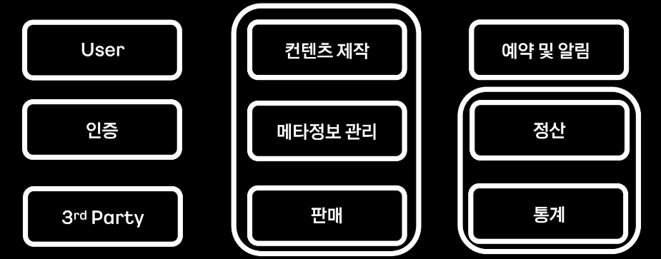

---
layout:
  title:
    visible: true
  description:
    visible: false
  tableOfContents:
    visible: true
  outline:
    visible: true
  pagination:
    visible: true
---

# DDD

기존에 개발은 MVC 형태의 레이어 아키텍처로 진행하였습니다.

controller -> service -> repository로 이루어져있고, 의존은 화살표 방향으로 이루어집니다.

그러던 중, 팀 스터디 내에서 `DDD` 에 대해서 이야기가 나왔습니다.

## DDD란?

DDD는 `Domain Driven Design` 으로, 도메인 주도 설계를 말합니다. 그렇다면 도메인 주도 설계가 무슨뜻일까요?

### Domain

도메인이란 기능적인 문제영역을 정의한 분야라고 할 수 있습니다.

### Domain Driven Design

위의 도메인과 도메인을 사용하는 비즈니스 로직을 중심으로 설계하는  것을 말합니다.

* 도메인의 모델과 로직에 집중
* 유비쿼터스 언어 사용
  * 개발팀 만이 아닌, 기획 개발 모두 보편적인 언어 사용
* 소프트웨어 Entity와 도메인 간 개념 일치

도메인 주도 설계는 도메인 전문가와 개발자가 팀을 이루고 지식을 탐구하여 함께 도메인 모델을 창조합니다. 이 때 만들어지는 **도메인 모델은 실제로 코드와 일치**해야 합니다. 더불어 모든 커뮤니케이션은 함께 정의된 유비쿼터스 언어를 활용해야 합니다.

DDD에서는 전략적 설계가 중요하다고 합니다. 전술적인 패턴에 대해 함몰되지 않도록 주의해야 합니다.

도메인 주도 설계의 목적은 소프트웨어가 해결해야 하는 문제영역의 복잡성을 낮추기 위함입니다.

### 전략적 설계

<figure><figcaption></figcaption></figure>

비즈니스 도메인에서 문제 도메인을 추출합니다. 문제 도메인을 문제 공간으로 풀고, 해결 공간으로 바꾸는 것까지가 DDD의 전략적 설계의 큰 흐름입니다.

비즈니스 도메인은 현실 세계에서 기업의 활동 영역을 말합니다. 회사의 비즈니스 영역에서 소프트웨어를 통해 해결하고자 할 때, 문제 영역이라고 합니다. 물론, 비즈니스 도메인 = 문제 도메인 일 수도 있습니다.

문제 공간을 인식하는 것으로 끝나지 않고, 문제 도메인을 작은 하위 도메인으로 나누어야 합니다.

예를 들어, 비즈니스 도메인에서 인터넷 예매라는 문제 도메인을 추출했다고 가정해보겠습니다. 이 때 이를 작은 하위 도메인들로 나누는 것을 문제 공간을 식별한다고 할 수 있습니다.

이 때 도메인 지식을 기반으로 유비쿼터스 언어를 사용하여 소통하고 하위 도메인을 만듭니다. 지속적인 의사소통을 통해 해당 도메인의 본질과 해결해야 할 문제를 잘 이해할 수 있게 됩니다.

<figure><figcaption></figcaption></figure>

회원 하위 도메인은 일반적으로 대부분의 소프트웨어가 가지므로 일반 하위 도메인이 됩니다. 가장 중요한 예매는 핵심 하위 도메인이 됩니다. 핵심과 일반을 제외한 도면, 상품은 지원 할인 도메인이 됩니다. 여기까지가 DDD의 전략적 설계에서 문제 공간을 확보하는 것입니다.

## DDD를 구현하기 위한 정의사항

### Bounded Context

> 범위를 구분해놓은 하위 도메인 개념.

<figure><figcaption></figcaption></figure>

콘텐츠 제작/메타정보 관리/판매가 하나의 바운더리로 묶이고 이는 MSA 상 하나의 서비스가 됩니다. 이렇게 분류된 Context는 서로의 도메인을 철저히 분리하고 API를 통한 CRUD를 수행하게 됩니다. 이 때 Bounded Context가 다르면, 유비쿼터스 언어도 달라져야 합니다.

<figure><figcaption></figcaption></figure>

위처럼 같은 언어이지만, Bounded Context에 따라 의미가 달라질 수 있습니다.

### Context Map

> Bounded Context 간의 관계.

<figure><figcaption></figcaption></figure>

Context Map.을 통해 up/down 스트림을 한 눈에 볼 수 있고, 전체적인 흐름을 예상할 수 있게 됩니다.

### Aggregate

> 데이터 변경 단위. 라이프 사이클이 같은 도메인을 모아놓은 집합.

<figure><figcaption></figcaption></figure>

Aggregate는 Root Entity를 통해서만 접근이 가능하도록 하고 해당 접근으로 인한 데이터의 변경은 내부의 모든 객체에 영향을 미치게 됩니다.

이렇게 Aggregate를 구성하게 되면, Video Product 내부 개별 객체의 상호작용보다는 외부의 다른 Aggregate나 객체들 사이의 관계를 조금 더 넓은 시야로 바라볼 수 있으며, 제약사항들을 하나의 맥락으로 관리할 수 있게 됩니다.

## DDD에 대한 궁금증

### JPA Entity와 Domain Entity를 분리시켜야 하나요?

원칙대로라면, JPA Entity와 Domain Entity를 분리해야 합니다.

JPA Entity는 DB 계층의 어댑터입니다. 이 때, JPA Entity와 Domain Entity를 유사하다고 느껴 Domain Entity를 삭제하고 JPA Entity를 도메인 계층으로 가져올 수 있습니다.

그런데 하나로 사용하게 되면 클래스, 패키지 구조는 단순화되지만, 영속성 계층과 도메인 계층이 강하게 결합됩니다. 또한 Domain Entity를 다룰 때 업무 규칙뿐만 아니라 연관관계 매핑, 지연 로딩 등을 고려해야 합니다.

### JPA Repository?

JPA Repository는 출력 포트가 아니라 어댑터입니다.

출력 포트는 Use Case가 필요로 하는 형태대로 유지되어야 합니다. Use Case가 DB의 세부 사항의 변경에 의해 바뀌어야 한다면 클린 아키텍처가 아닙니다. 적어도 출력 포트의 로직이 한 번의 호출로 해결되지 않게 되면 분리해야 합니니다.

### Use Case를 꼭 인터페이스로 뽑아야할까?

Use Case는 인터페이스로 뽑아야 합니니다. Controller가 Service의 구현에 대해 너무 많이 알지 못하도록 막기 위해 존재합니다. 스펙을 따로 분리한다는 측면에서도 인터페이스로 따로 분리하는게 좋습니.

## 어떻게 써야 DDD일까?

DDD에 대해 찾게된 이유는 새 프로젝트에서 DDD를 적용시키고자 찾아보기 시작했습니다. 하지만 찾아볼수록 '이렇게 해야 DDD다!' 라는 방식의 결론은 없는 것 같습니다. DDD는 아키텍처가 아니라, 하나의 바라보는시선(?)이라고 느껴졌습니다.

아키텍처는 이러한 방법을 적용시킬 수단이라고 생각합니다. 실제로 도메인 주도 설계에서 기술적인 것에 너무 치중되지 말라고 이야기합니다.

***

#### 참고












