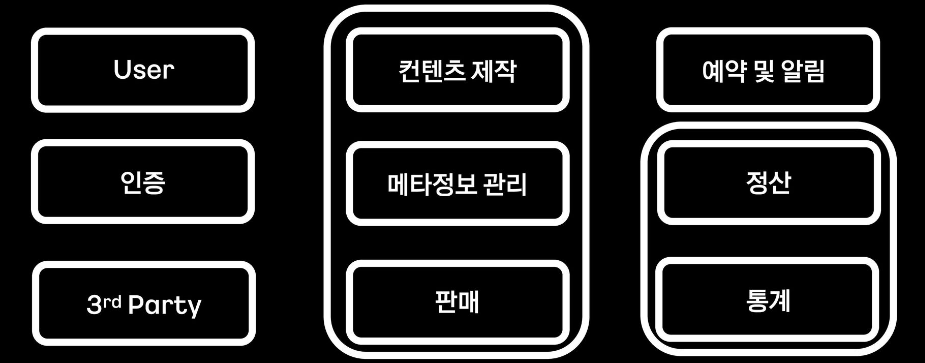

---
layout:
  title:
    visible: true
  description:
    visible: false
  tableOfContents:
    visible: true
  outline:
    visible: true
  pagination:
    visible: false
---

# JWT 토큰

## JWT 토큰

JWT(Json Web Token)은 Json 객체에 인증에 필요한 정보들을 담은 후 비밀키로 서명한 토큰으로, **인터넷 표준 인증 방식**이다.  공식적으로 **인증(Authentication) & 권한허가(Authorization)** 방식으로  사용된다.&#x20;

## JWT 프로세스

<figure><figcaption></figcaption></figure>

#### 로그인 전

1. 사용자는 서버에 `로그인 요청` 을 보낸다.
2. 서버는 `비밀키` 를 이용하여 json 객체를 암호화한 `JWT 토큰`을 발급한다.
3. JWT를 `헤더` 에 담아 클라이언트에게 보낸다.

#### 로그인 후

1. 클라이언트는 JWT를 로컬에 저장한다.
2. API 호출을 할 때마다 헤더에 JWT를 실어서 보낸다.
3. 서버는 헤더를 매번 확인하여 `사용자가 신뢰할 수 있는지 체크` 하고, 인증이 되면 API에 대한 응답을 보낸다.

## 매번 JWT를 해더에 넣어야 하는 이유

HTTP는 `Connectionless`, `Stateless`한 특성을 가지고 있다.

* Connectionless: 한번 통신이 이루어지고 난 후 연결이 바로 끊어진다.
* Stateless: 이전 상태를 유지/기억하지 않는다.

따라서 화면을 이동하여 새로운 API를 요청하면 다시 신뢰할 수 있는 사용자인지 인증하는 과정을 거쳐야 한다. 매번 사용자가 인증하는 과정은 통신이 느려지게 할 수 있다.

인증된 사용자가 어느정도 기간동안 재인증하지 않아도 되도록(로그인이 유지되도록) 만든 것이 `Access Token` 이다.

## JWT의 구조

JWT는 `Header`, `Payload`, `Signature` 3개로 구성되어 있다.

#### Header

* alg: Signature에서 사용하는 알고리즘
* typ: 토큰 타입

Signature에서 사용하는 알고리즘은 대표적으로 `RS256(공개키/개인키)`와 `HS256(비밀키/대칭키)` 가 있다.

#### Payload

사용자 정보의 한 조각인 `클레임(claim)`이 들어있다.

* sub: 토큰 제목
* aud: 토큰 대상자
* iat: 토큰이 발급된 시각
* exp: 토큰의 만료 시각

#### Signature

Signature는 헤더와 페이로드의 문자열을 합친 후에, **헤더에서 선언한 알고리즘과 key를 이용해 암호화한 값**이다.

Header와 Payload는 단순히 `Base64url` 로 인코딩되어 있어 누구나 쉽게 복호화할 수 있지만, Signature는 key가 없으면 복호화할 수 없다. 이를 통해 **보안상 안전하다**는 특성을 가질 수 있게 되었다.

앞에 언급한 것처럼 `header` 에서 선언한 알고리즘에 따라 key는 개인키가 될 수도 있고 비밀키가 될 수도 있다. 개인키로 서명했다면 공개키로 유혀성 검사를 할 수 있고, 비밀키로 서명했다면 비밀키를 가지고 있는 사람만이 암호화, 복호화, 유효성 검사를 할 수 있다.
